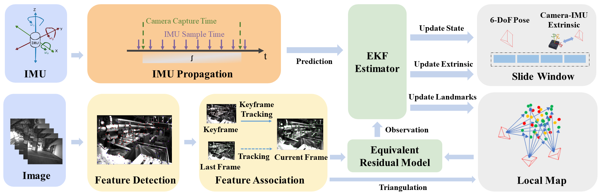

# LR-VIO: Lightweight and Robust Visual-Inertial Odometry(ICRA2025 Submission)

- Paper

**Lightweight and Robust Visual-Inertial Odometry**, Changze Li, Hao Wei, Jingyang Huang, Tong Qin, Fei Gao, and Ming Yang

- System Architecture

